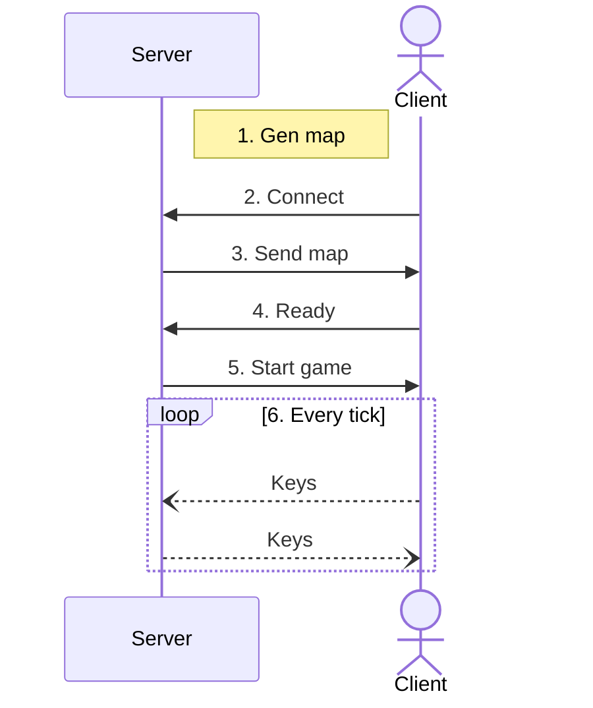
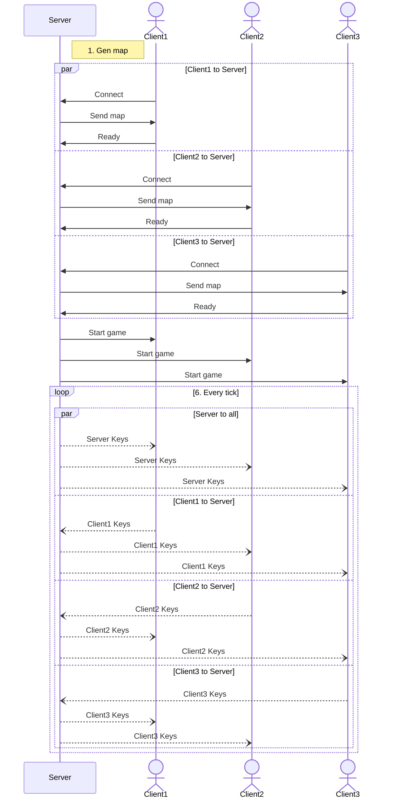

# Долгосрочное задание

Многопользовательский "пакман" без врагов, на 2-4 игроков. Задача каждого игрока -- набрать больше всего очков. Карта генерируемая, симметричная по двум осям. Сетевое взаимодействие после начала игры ограничивается передачей нажатых игроками кнопок в соответствии с указанным протоколом. Состояние клиентов и сервера не должно расходиться, все клиенты и сервер должны одновременно сообщить пользователю о завершении игры.

Условие завершения игры: на игровом поле не осталось клеток, содержащих "еду", т.е. остались только игроки и стены. За каждую поглощенную клетку еды игрок получает +1 очко. При равенстве очков считаем, что победителя нет (ничья).

## Генерация игрового поля

- Игровое поле имеет логический размер 40x30;
- Каждая клетка поля изначально может являться стеной, "едой" или стартовой позицией игрока (пустых клеток при генерации нет);
- Генерируется только часть карты 20x15 (четверть), остальное поле заполняется симметрично;
- На генерируемой части карты должна быть только одна стартовая позиция игрока.
- Координаты игрового поля: $0 <= x < 40; 0 <= y < 30$

Алгоритм генерации поля ограничивается следующим условием: каждая свободная клетка поля с "едой" должна быть достижима любым игроком.

> Предположение по алгоритму генерации: если у каждой клетки, не являющейся стеной, будет хотя бы две соседних клетки, не являющимися стенами, то в большинстве случаев карта будет играема.

## Перемещение игрока

Игрок идет в последнем выбранном направлении до тех пор, пока не упрется в препятствие. Препятствием являются стены и другие игроки. Пользователь может изменить направление движения нажатием соответствующих кнопок (wasd, стрелки, цифры -- любой вариант допустим).

При старте игры каждый игрок двигается в стандартном направлении (выбирается сервером, совпадает для всех игроков с точностью до осей симметрии игрового поля).

Игрок перемещается на 1 клетку за игровой кадр.

## Запуск программы

Исполняемый файл должен иметь возможность использоваться и в качестве клиента, и в качестве сервера. При запуске необходимо указать флаг для режима сервера или клиента.

- Для сервера дополнительно необходимо указать прослушиваемый порт и ожидаемое количество игроков;
- Для клиента -- адрес и порт сервера.

## Ход игры

### 2 игрока (сервер и клиент)

1. Сервер генерирует карту, затем открывает порт на прослушивание;
2. Клиент подключается;
3. Сервер отправляет клиенту сгенерированную часть карты;
4. Клиент отправляет серверу сообщение о готовности;
5. Сервер сообщает клиенту о начале игры;
6. Начинается игра, с этого момента по сети передается только информация о нажатиях игроками клавиш направления.



### 4 игрока

- количество игроков (от 2 до 4) задается ключом при запуске;
- сервер генерирует карту, открывает порт на прослушивание;
- клиенты подключаются, сервер ждет указанное количество клиентов;
- при каждом подключении клиента сервер отправляет ему карту;
- сервер ожидает подтверждение готовности от каждого клиента;
- сервер сообщает, что игра начинается.

Все клиенты отправляют информацию о нажатых пользователем кнопках серверу, а сервер пересылает их всем, кроме этого клиента.



## Сетевой протокол

Числа передаются в network order.

У всех сообщений одинаковая структура (заголовок):

```c
const uint32_t magic = 0xabcdfe01;
uint32_t ptype;
uint32_t datasize;
uint8_t* data;
```

### Пакеты

| `ptype`    | этап | описание                                | `data`                                    | `datasize` |
|:----------:|:----:| --------------------------------------- | ----------------------------------------- |:----------:|
|   `0x01`   |  2   | клиент отправляет пакет при подключении | `char* playername`                        |   < 256    |
|   `0x10`   |  3   | сервер отправляет карту                 | `uint8_t* gamefield`                      |   20\*15   |
|   `0x02`   |  4   | клиент готов                            | empty                                     |     0      |
|   `0x20`   |  5   | начало игры                             | см. раздел с описанием этого пакета       |            |
|   `0x00`   |  6   | нажатие кнопки на клиенте               | `uint8_t direction`                       |     1      |
|`0xffffffff`|  6   | проброс нажатий сервером                | см. раздел с описанием этого пакета       |            |

#### Инициализационный пакет клиента (`ptype == 0x01`)

Клиент отправляет серверу свое имя. Если имя клиента повторилось -- сервер должен проигнорировать этого клиента и разорвать соединение с ним. Максимально допустимая длина имени - 255 ASCII-символов или 256 байт, включая `\0` в конце строки.

#### Пакет с игровым полем (`ptype == 0x10`)

Сгенерированная часть поля размером 20x15, содержимое -- по 1 байту на клетку, обозначает игрока, стены и "еду". Поле конвертируется в одномерный массив так, что сначала в массиве идет строка с `y=0`, потом с `y=1` и так далее.

Клиент разворачивает полное поле сам.

Пример для поля 6x2:

```txt
x=0,y=0                                  x=5,y=0
-------------------------------------------------
| a[0]  | a[1]  | a[2]  | a[3]  | a[4]  | a[5]  |
-------------------------------------------------
| a[7]  | a[8]  | a[9]  | a[10] | a[11] | a[12] |
-------------------------------------------------
x=0,y=1                                  x=5,y=1
```

Значения клеток поля:

- стена: `0xff`;
- еда: `0xaa`;
- игрок: `0x22`.

#### Пакет перед началом игры (`ptype == 0x20`)

`frame_timeout` отправляется так поздно, чтобы теоретически сервер мог его скорректировать, если обнаружит медленный клиент (с плохим соединением). В этом поле указываются миллисекунды между кадрами.

```c
uint32_t frame_timeout;
uint32_t player_count;
struct player players[player_count];
```

В массиве `players` передается информация о всех игроках, участвующих в сессии. Координаты, начальное направление и имя.
После получения этого пакета игровой движок должен начать работу.

```c
struct player {
  uint32_t start_x;
  uint32_t start_y;
  uint32_t start_direction;
  uint32_t player_name_len;
  uint8_t player_name[];
};
```

#### Пакет с информацией о нажатой клиентом кнопкой (`ptype == 0x00`)

Клиент отправляет пакет с общим заголовком, содержимое имеет длину 1 байт, значение выбирается в соответствии с нажатой кнопкой:

- вверх: `0` (`y -= 1`);
- вправо: `1` (`x += 1`);
- вниз: `2` (`y += 1`);
- влево: `3` (`x -= 1`).

#### Пакет с информацией о нажатой другим клиентом кнопкой (`ptype == 0xffffffff`)

Сервер отправляет всем клиентам пакет, в котором сообщает какую кнопку нажал клиент (кроме самого нажавшего).

Передаются два поля. 1 байт направления (см. предыдущий пакет) и имя игрока, совершившего нажатие.

```c
uint8_t direction;
char* player_name;
```
